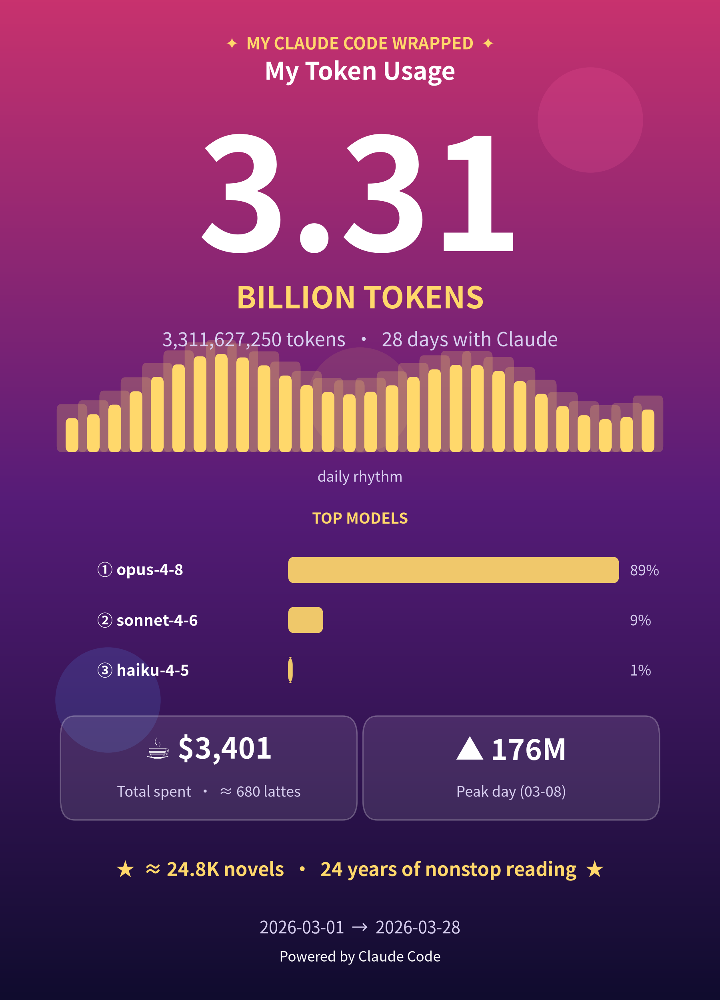
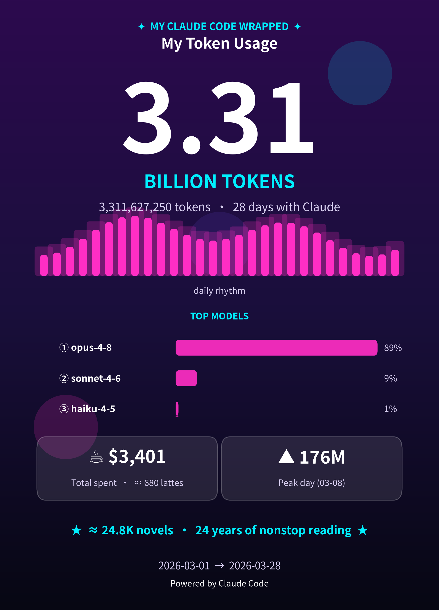
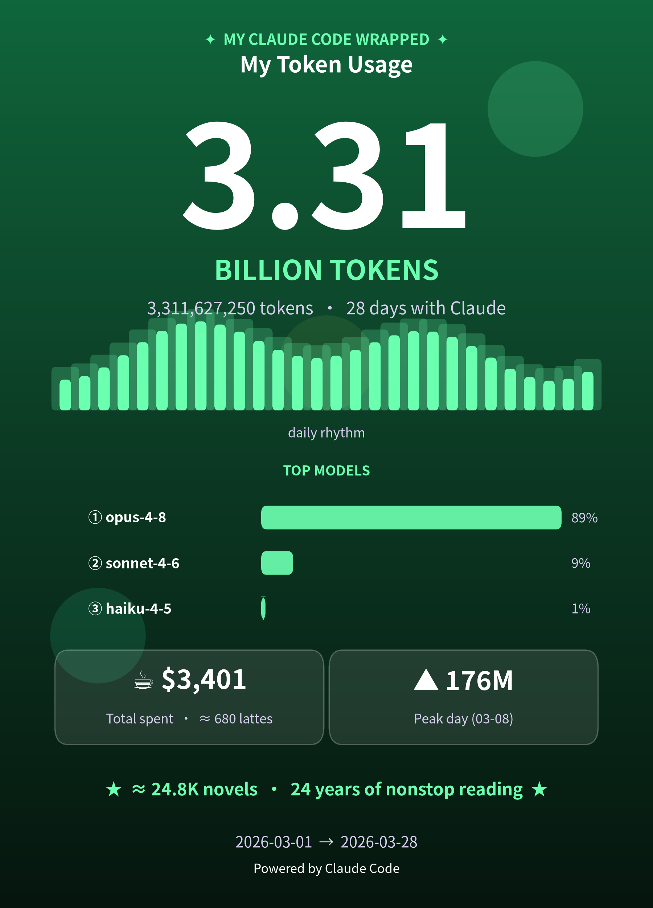
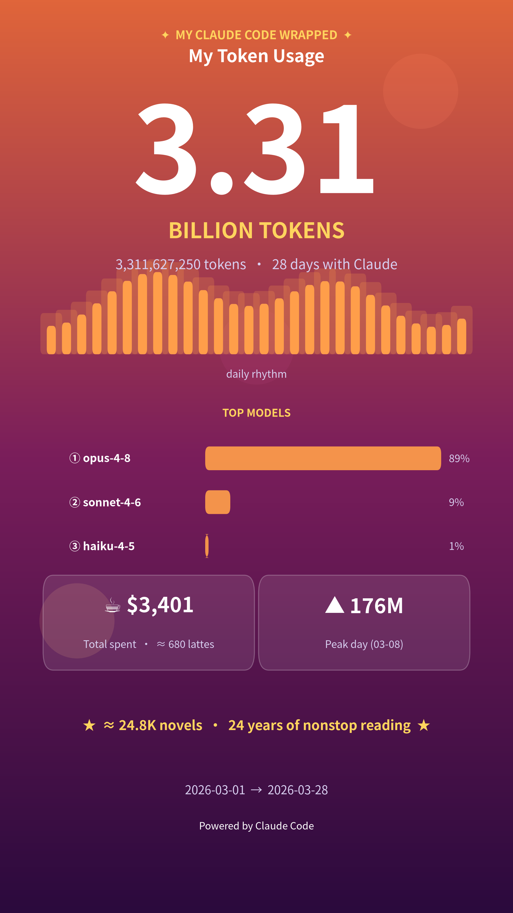
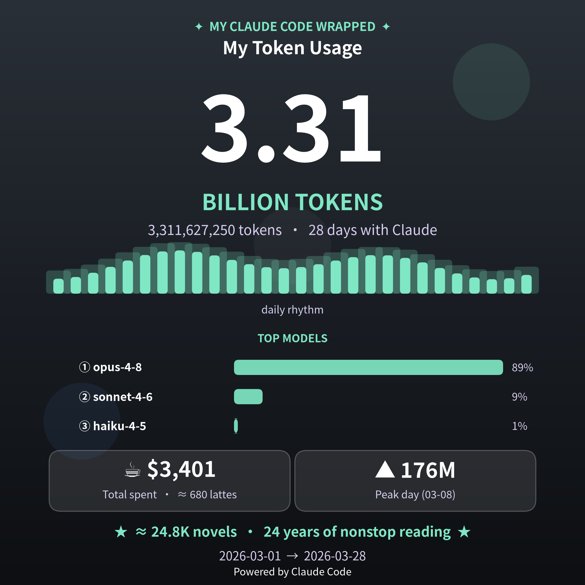
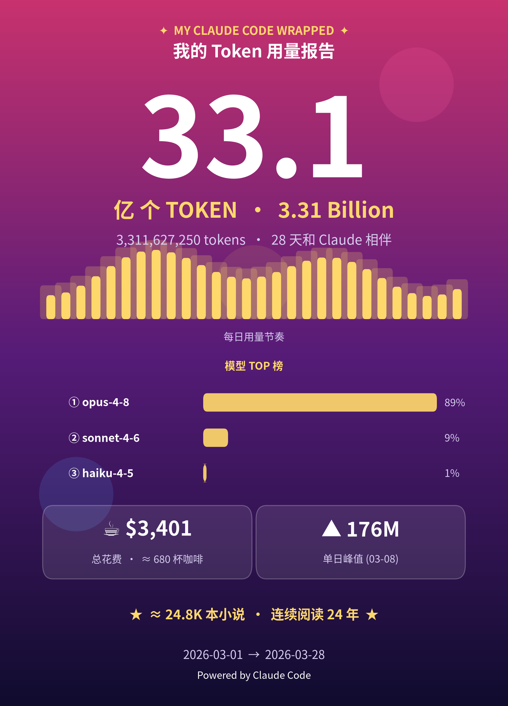
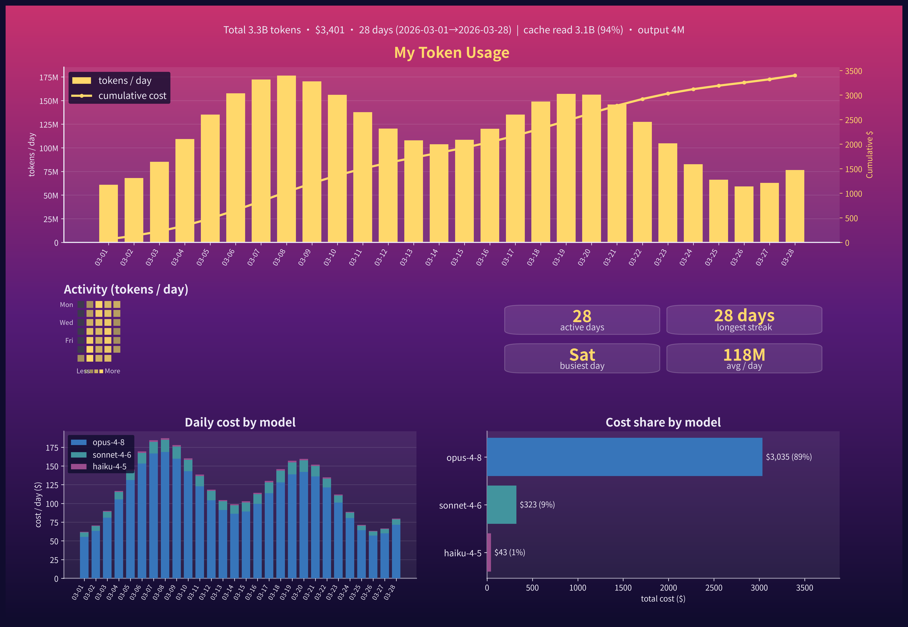

# 🎁 Token Wrapped

> One sentence → your **Claude Code** token-usage stats for any date range, as a
> shareable "Wrapped" poster *and* a multi-panel dashboard, in the style you pick.

**English** · [中文](#-中文)

A [Claude Code](https://claude.com/claude-code) **skill** (also runnable as plain CLI
scripts). It reads your local usage logs via [`ccusage`](https://github.com/ryoppippi/ccusage),
merges multiple machines, and renders:

- **`token_wrapped.png`** — a portrait poster built for sharing (Spotify-Wrapped vibe),
  with a **TOP MODELS** ranking and tasteful fun-facts
- **`token_dashboard.png`** — a landscape analytics chart (daily tokens, cumulative cost,
  a GitHub-style **activity heatmap**, summary tiles, and per-model breakdown)

Both also export `.pdf` (vector).

<p align="center">
  
  
  
</p>
<p align="center">
  
  
  
</p>
<p align="center"></p>
<p align="center"><sub>↑ rendered from synthetic demo data (<code>samples/</code>), not a real account</sub></p>

---

## Quick start (as a skill)

Copy this folder into `~/.claude/skills/token-wrapped/`, then just ask Claude Code:

```
/token-wrapped last 7 days, cyber green style
/token-wrapped this month, story size for instagram
/token-wrapped all time --no-fun
/token-wrapped 本月，赛博紫风格，中文
```

Claude resolves the date range, picks the flags, runs the scripts, and shows you the images.

## Quick start (as CLI)

```bash
pip install matplotlib          # ccusage must also be on PATH (npx works too)
SKILL=~/.claude/skills/token-wrapped

# one-shot wrapper (collect + render):
python $SKILL/wrapped.py --start 2026-06-01 --end 2026-06-24 \
                         --lang en --style cyber_purple --size poster --out-dir .

# …or the two steps explicitly:
python $SKILL/collect.py --start 2026-06-01 --end 2026-06-24 --out merged_usage.json
python $SKILL/render.py  --data merged_usage.json --lang en --style cyber_purple --out-dir .
```

---

## Features

| | |
|---|---|
| **Any date range** | `--start/--end`, or omit for all-time |
| **Multi-machine** | drop other machines' `ccusage` JSON into `~/.claude/ccusage_extra/`; auto-merged per day & per model |
| **Bilingual** | `--lang en` (default) or `--lang zh` — copy and number units adapt (B/M vs 亿) |
| **8 style presets** | `cyber_purple` · `neon_night` · `blue_gold` · `cyber_green` · `minimal_white` · `sunset` · `graphite` · `sakura` |
| **Theme files** | `--style NAME` loads `NAME.json` from `~/.claude/token-wrapped-themes/` or `themes/` |
| **Custom colors** | `--style custom --bg "#a,#b,#c" --accent "#d" --bars "#e" --text light\|dark` |
| **3 canvas sizes** | `--size poster` (portrait) · `story` (9:16) · `square` (1:1) |
| **Custom font** | `--font "Font Name"` for brand fonts / CJK |
| **Pro mode** | `--no-fun` drops the playful comparisons; `--coffee-price` tunes the latte metric |
| **Two outputs** | `--what both\|poster\|dashboard` |

### Styles

`cyber_purple` (default), `neon_night`, `blue_gold`, `cyber_green`, `minimal_white`,
`sunset`, `graphite`, `sakura`. Light backgrounds (`minimal_white`, `sakura`) use dark
text automatically.

### Custom theme files

Drop a JSON into `~/.claude/token-wrapped-themes/` (or this repo's `themes/`) and reference
it by file name via `--style`:

```json
{
  "bg": ["#02040A", "#0A1430", "#13284F"],
  "accent": "#9FE8FF",
  "bars": "#4FC3F7",
  "text": "light",
  "glows": [["#4FC3F7", 0.14], ["#9FE8FF", 0.10], ["#FFFFFF", 0.05]]
}
```

```bash
python render.py --data merged_usage.json --style midnight   # → themes/midnight.json
```

---

## How it works

```
collect.py   ccusage daily --json  +  ~/.claude/ccusage_extra/*.json
             → sum per day & per model → clip to range → merged_usage.json
render.py    merged_usage.json → token_wrapped.{png,pdf} + token_dashboard.{png,pdf}
```

`merged_usage.json` schema: `{ range, sources, daily[], totals }`. `collect.py` accepts
both `ccusage` entry shapes (`date`-keyed and `period`-keyed).

### Multi-machine

```bash
# on each other machine:
ccusage daily --json > laptop.json
# then copy laptop.json into ~/.claude/ccusage_extra/ on your main box
```

Overlapping dates are **summed** (one person across several machines).

---

## Project layout

```
token-wrapped/
├── SKILL.md            # Claude Code skill manifest + instructions
├── collect.py          # ccusage + multi-machine merge → merged_usage.json
├── render.py           # merged_usage.json → poster + dashboard (i18n, styles, sizes)
├── wrapped.py          # one-shot wrapper (collect + render)
├── themes/             # example custom theme files (--style NAME)
├── samples/            # synthetic demo data + example images
│   ├── gen_sample.py   #   regenerate the demo data
│   └── *.png
├── README.md  LICENSE  requirements.txt
```

Regenerate the demo images:

```bash
python samples/gen_sample.py
python render.py --data samples/sample_usage.json --style cyber_purple --out-dir samples
```

## Requirements

- Python 3.8+ with `matplotlib`
- [`ccusage`](https://github.com/ryoppippi/ccusage) on `PATH` (or `npx ccusage@latest`)
- For `--lang zh`: a CJK font (e.g. `fonts-noto-cjk`)

## Notes

- matplotlib can't render color-emoji; the poster uses monochrome symbols only.
- Fun-fact constants (`WORDS_PER_TOKEN`, `WORDS_PER_NOVEL`, `READING_WPM`) live at the
  top of `render.py` — they are rough, for fun, and easy to tweak.

## License

[MIT](./LICENSE)

---

## 🎁 中文

> 一句话 → 把你在 **Claude Code** 上任意时间段的 token 用量,变成一张可分享的
> "Wrapped" 海报 **和** 一张多面板数据看板,风格任你挑。

[English](#-token-wrapped) · **中文**

这是一个 [Claude Code](https://claude.com/claude-code) **技能(skill)**(也可当普通 CLI 脚本跑)。
它通过 [`ccusage`](https://github.com/ryoppippi/ccusage) 读取你本地的用量日志,合并多台机器的数据,渲染出:

- **`token_wrapped.png`** —— 为分享而生的竖版海报(Spotify-Wrapped 风格),
  含 **模型 TOP 榜** 和恰到好处的趣味类比
- **`token_dashboard.png`** —— 横版分析看板(每日 token、累计成本、GitHub 风格
  **活跃热力图**、关键数据磁贴、按模型拆分)

两者都额外导出 `.pdf` 矢量版。

### 快速开始(作为 skill)

把本文件夹拷到 `~/.claude/skills/token-wrapped/`,然后直接对 Claude Code 说:

```
/token-wrapped 最近7天，赛博绿风格
/token-wrapped 本月，story 尺寸发朋友圈
/token-wrapped 全部时间 --no-fun
/token-wrapped this month, cyber purple, in chinese
```

Claude 会自动解析日期范围、挑选参数、运行脚本并把图给你。

### 快速开始(作为 CLI)

```bash
pip install matplotlib          # ccusage 也需在 PATH 上(用 npx 亦可)
SKILL=~/.claude/skills/token-wrapped

# 一键封装(采集 + 渲染):
python $SKILL/wrapped.py --start 2026-06-01 --end 2026-06-24 \
                         --lang zh --style cyber_purple --size poster --out-dir .

# …或拆成两步:
python $SKILL/collect.py --start 2026-06-01 --end 2026-06-24 --out merged_usage.json
python $SKILL/render.py  --data merged_usage.json --lang zh --style cyber_purple --out-dir .
```

### 功能

| | |
|---|---|
| **任意日期区间** | `--start/--end`,不填则为全部时间 |
| **多机合并** | 把其它机器的 `ccusage` JSON 丢进 `~/.claude/ccusage_extra/`,按天、按模型自动合并 |
| **中英双语** | `--lang en`(默认)或 `--lang zh` —— 文案与数字单位自适应(B/M vs 亿) |
| **8 套风格预设** | `cyber_purple` · `neon_night` · `blue_gold` · `cyber_green` · `minimal_white` · `sunset` · `graphite` · `sakura` |
| **主题文件** | `--style NAME` 会加载 `~/.claude/token-wrapped-themes/` 或 `themes/` 下的 `NAME.json` |
| **自定义配色** | `--style custom --bg "#a,#b,#c" --accent "#d" --bars "#e" --text light\|dark` |
| **3 种画幅** | `--size poster`(竖版)· `story`(9:16)· `square`(1:1) |
| **自定义字体** | `--font "字体名"`,适配品牌字体 / 中文字体 |
| **专业模式** | `--no-fun` 去掉趣味类比;`--coffee-price` 调整"咖啡"换算 |
| **两种产物** | `--what both\|poster\|dashboard` |

### 自定义主题文件

把一个 JSON 丢进 `~/.claude/token-wrapped-themes/`(或本仓库的 `themes/`),用 `--style` 按文件名引用即可:

```json
{
  "bg": ["#02040A", "#0A1430", "#13284F"],
  "accent": "#9FE8FF",
  "bars": "#4FC3F7",
  "text": "light",
  "glows": [["#4FC3F7", 0.14], ["#9FE8FF", 0.10], ["#FFFFFF", 0.05]]
}
```

```bash
python render.py --data merged_usage.json --style midnight   # → themes/midnight.json
```

### 多机合并

```bash
# 在每台其它机器上:
ccusage daily --json > laptop.json
# 再把 laptop.json 拷到主力机的 ~/.claude/ccusage_extra/ 里
```

日期重叠的会**相加**(同一个人、多台机器)。

### 依赖

- Python 3.8+,装有 `matplotlib`
- [`ccusage`](https://github.com/ryoppippi/ccusage) 在 `PATH` 上(或用 `npx ccusage@latest`)
- 用 `--lang zh` 需要中文字体(如 `fonts-noto-cjk`)

### 说明

- matplotlib 无法渲染彩色 emoji,海报只用单色符号。
- 趣味类比常量(`WORDS_PER_TOKEN`、`WORDS_PER_NOVEL`、`READING_WPM`)在 `render.py` 顶部,
  仅供娱乐、可随意调整。

### 许可证

[MIT](./LICENSE)
